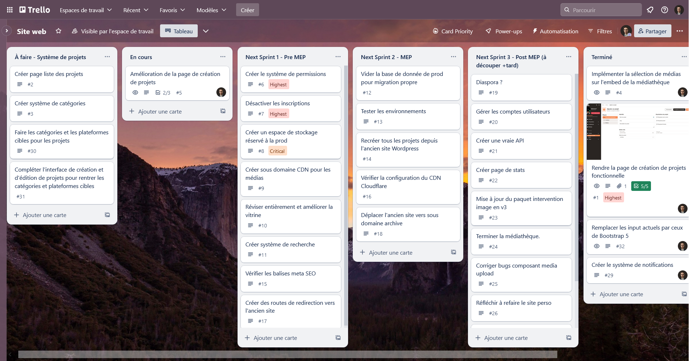
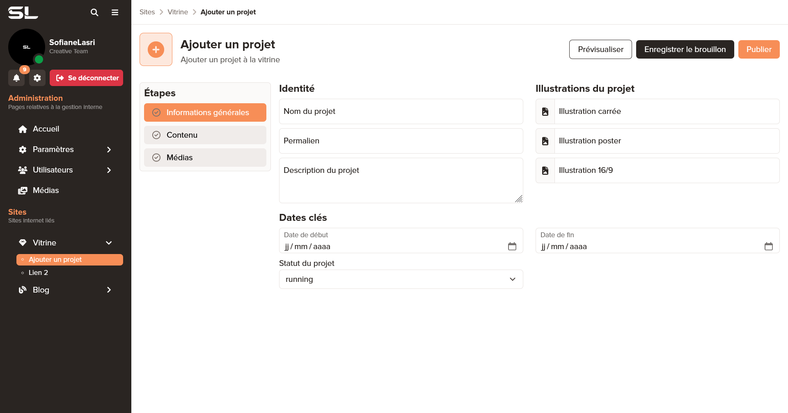
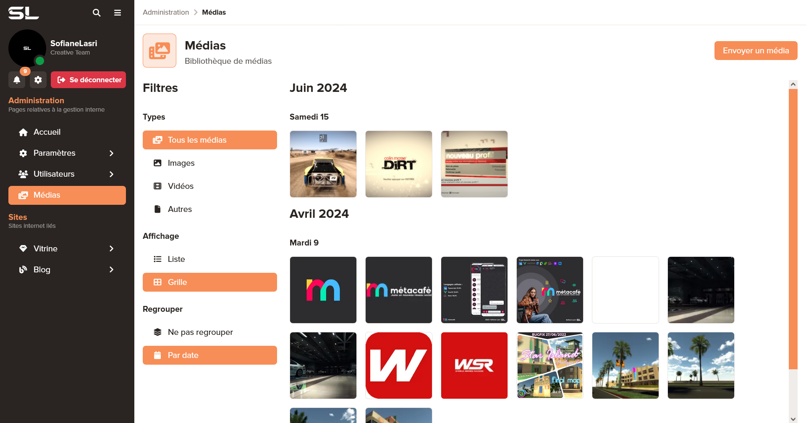
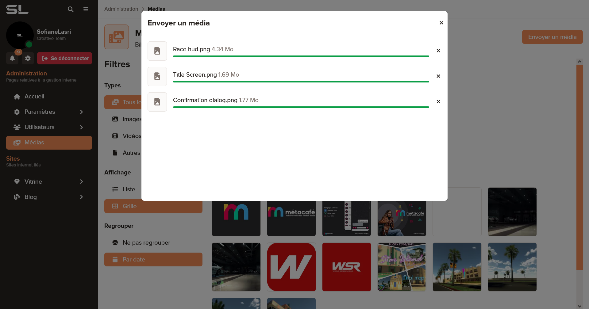
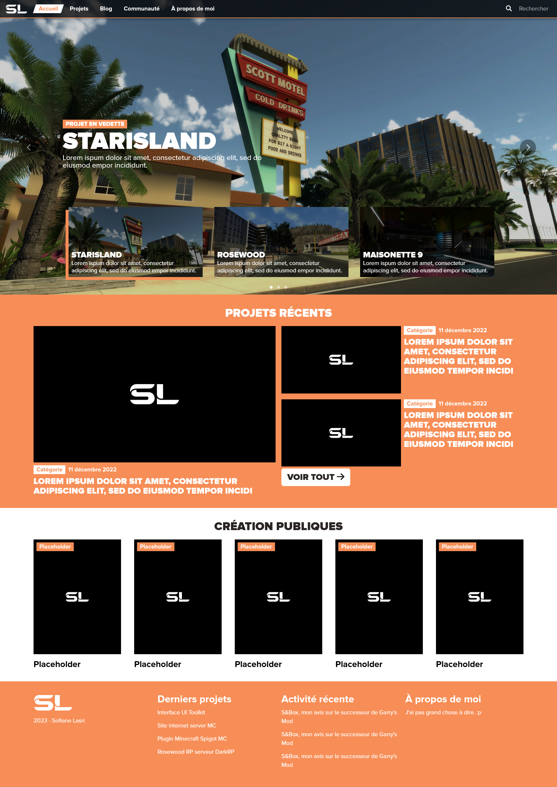

## Information 15 Juin 2024

J'ai décidé de cesser le développement du projet, après presque 2 ans de développement.

La principale raison de cette décision est le temps monstrueux que me demandais ce projet pour sa réalisation, mais 
également les divers changements de direction que j'ai pris le concernant. En effet, si au départ, il était question de 
réaliser une plateforme web qui regrouperait l'ensemble de mes projets (site perso, blog, portfolio, etc.), j'ai 
rapidement décidé de séparer ces projets pour les rendre indépendants les uns des autres. 

De plus, l'envie de séparer le nom "SL-Projects" de mes projets personnels, afin de pouvoir l'utiliser dans des projets 
plus sérieux, m'a poussé à revoir entièrement mes plans et à réorienter l'intérêt de certains projets. Ainsi, la 
décision de cesser le développement de cette plateforme m'est rapidement venue à l'esprit. Si toutefois, il était prévu 
de la terminer avant de l'abandonner, la nécessité de recréer entièrement le site vitrine et le site portfolio afin 
d'exploiter les nouvelles maquettes, m'a convaincu de ne pas continuer.

C'est ainsi que se termine l'aventure de ce projet. J'en reste très satisfait. Ayant pu expérimenter et apprendre 
énormement de choses, il m'a permis d'acquérir une bonne expérience avec Laravel, TypeScript et la création de libraires 
graphiques basées sur Bootstrap.

Pour ceux qui se demandent, le projet était loin d'être terminé. Voici un aperçu du Trello au moment où j'écris ce 
readme :

 

## Captures d'écrans

Le texte ci-dessous est laissé tel quel à titre historique.

## À propos du projet

Ce projet est la plateforme web de SL-Projects. Il concentre les sous projets suivants :
- Site internet vitrine (https://sl-projects.com)
- Panneau d'administration des projets annexes (https://dashboard.sl-projects.com)
- API (https://api.sl-projects.com)
- Authentification centralisée (https://auth.sl-projects.com)
- Blog (prochainement) (https://blog.sl-projects.com)
- Portfolio personnel (sera dissocié à terme) (https://sofianelasri.fr)

## Installation

### Prérequis

- PHP 8.1 ou supérieur
- Extension PHP (Il peut en manquer) : PDO, JSON, CURL, INTL, GD, Fileinfo, OpenSSL, Mbstring, BCMath, Tokenizer, XML, Ctype, Zip, FTP

### Procédure

1. Cloner le projet
2. Installer les dépendances : `composer install`, `npm install`
3. Migrer la base de données : `php artisan migrate`
3. Copier le fichier `.env.example` en `.env` et le modifier en fonction de votre environnement (en local uniquement, si sur dev srv copier l'env de quelqu'un d'autre)
4. Générer une clé d'application (en local uniquement) : `php artisan key:generate`
5. Copier les routes avec Ziggy : `php artisan ziggy:generate`
6. Compiler les assets : `npm run build`

## Usage image Docker (en local)

1. Le serveur web plante au démarrage, probablement à cause des points de montage qui se font légèrement après avoir lancé le serveur. Il faut donc relancer le serveur depuis la console.
2. Les identifiants de connexion ssh sont les suivants :
   - Utilisateur : `root`
   - Mot de passe : `password`
